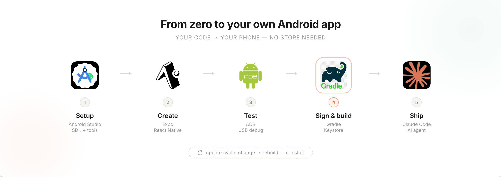

<div align="center">



<br/>

# Local Android App

**Build and update a local Android app on Windows + Android using Expo, Android Studio, and a chat-enabled IDE that can read the repository and follow step-by-step skill files.**

<br/>


</div>

---

This repository is designed for people who want to:

- create their **first local Android app**
- install it on their **own Android phone**
- avoid the Play Store
- update the installed app later with a new APK
- keep the full workflow documented inside the repository

---

## 👤 Who this is for

This repository is for users who already have the basic environment installed and want a guided, repeatable workflow.

**Typical setup:**

- Windows PC
- Android phone with USB debugging enabled
- Android Studio installed
- Node.js and npm installed
- Expo / React Native project workflow available
- a chat-enabled IDE or agent that can read files inside the repository

> **Before doing anything, read:**
> [`requirements-for-local-android-skills.md`](./requirements-for-local-android-skills.md)
>
> That file lists everything required before running the skill workflows.

---

## 📁 What is inside this repository

**Recommended root structure:**

```text
local-android-app/
├── README.md
├── first-prompt.md
├── requirements-for-local-android-skills.md
├── expo-android-local-first-app/
│   ├── SKILL.md
│   ├── agents/
│   └── references/
└── android-local-app-update/
    ├── SKILL.md
    ├── agents/
    └── references/
```

### Main files

| File | Purpose |
|------|---------|
| `README.md` | the public entry point for the repository |
| `first-prompt.md` | the first prompt to paste into your IDE chat so the agent knows how to use the repo |
| `requirements-for-local-android-skills.md` | the prerequisite checklist |

### Skill folders

| Folder | What it does |
|--------|-------------|
| `expo-android-local-first-app/` | builds the first local Android app and installs a standalone APK on a connected Android phone |
| `android-local-app-update/` | updates the already installed local Android app by rebuilding and reinstalling a new APK |

---

## 🚀 How to use this repository

### 1. Clone the repository

Clone this repository to your Windows machine and open it in your IDE.

### 2. Make sure the prerequisites are already done

Open [`requirements-for-local-android-skills.md`](./requirements-for-local-android-skills.md)

If anything in that file is missing, complete it first.

### 3. Open the repository in your chat-enabled IDE

Use an IDE or coding agent that can read the repository files directly.

The workflow assumes the agent can:

- read markdown files in the repo
- follow step-by-step instructions
- stop after failed checks
- run commands when needed
- keep the work inside the repository unless a local Android or ADB command is required

### 4. Start with the first prompt

Open [`first-prompt.md`](./first-prompt.md) and paste that prompt into your IDE chat.

That prompt tells the agent to:

- find the requirements file
- find both skill folders
- verify prerequisites
- use the **first-app** skill first
- move one step at a time
- test after each step
- stop and fix issues before continuing

### 5. Build your first local Android app

The agent should use: [`expo-android-local-first-app/SKILL.md`](./expo-android-local-first-app/SKILL.md)

That workflow covers:

- verifying the Android device connection
- creating the Expo project
- running the app locally
- creating a development build
- creating a signed standalone APK
- installing the APK on the Android phone

### 6. Update the installed app later

Once the app already exists on the phone, use: [`android-local-app-update/SKILL.md`](./android-local-app-update/SKILL.md)

That workflow covers:

- changing the app code
- bumping version values
- rebuilding the signed release APK
- reinstalling the APK as an update on the phone

---

## 🗺️ Recommended user flow

If you are new, use this order:

| Step | Action |
|------|--------|
| 1 | Read `requirements-for-local-android-skills.md` |
| 2 | Paste the content of `first-prompt.md` into your IDE chat |
| 3 | Run the **first app** skill |
| 4 | Confirm the standalone APK works without the laptop |
| 5 | When you want to change the app later, run the **update** skill |

---

## ⚠️ Important notes

> - This repository is meant for **local Android app development**, not Play Store publishing.
> - The standalone update flow depends on keeping the **same Android package name** and **same signing keystore**.
> - Do not delete or replace your keystore if you want future local updates to install over the existing app.
> - During development, a development build may still use the laptop dev server.
> - A standalone release APK should run on the phone without Expo Go and without the laptop.

---

## 🔧 Troubleshooting

If something fails:

- check the `references/` troubleshooting files inside each skill folder
- re-run the test for the current step
- only continue after the test passes

> Do not skip failed steps. The skills are written to pause, test, fix, and continue.
